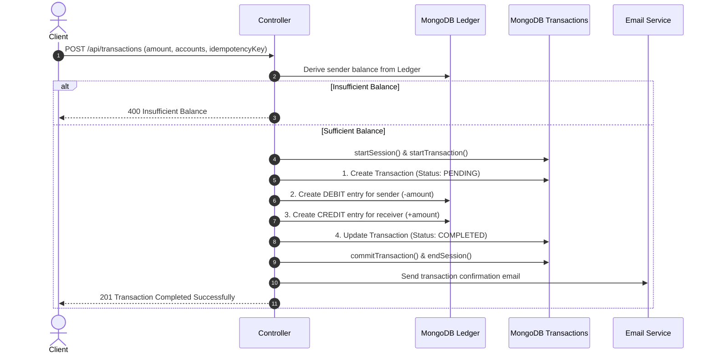

# 🏦 Banking & Financial Ledger API

A robust, production-ready Banking & Financial Ledger backend built with **Node.js, Express, MongoDB, and Mongoose**. 

Designed around **Double-Entry Bookkeeping**, **ACID Transactions**, **Idempotent API design**, and **JWT Authentication with Token Blacklisting (TTL)**.

---

## 🌟 Core Architecture & Features

### 1. ⚖️ Double-Entry Bookkeeping System
- In financial accounting, money is never directly edited (e.g. `balance = balance - 500`).
- Account balance is **dynamically derived** from an append-only, immutable **Ledger**:
  $$\text{Account Balance} = \sum(\text{CREDIT}) - \sum(\text{DEBIT})$$
- All ledger modifications and deletions are intercepted and blocked at the schema level.

### 2. 🛡️ ACID Transactions via MongoDB Sessions
- Fund transfers between accounts use multi-document **MongoDB transactions** (`startSession()` and `startTransaction()`).
- All 4 operations (transaction creation, debit ledger entry, credit ledger entry, status finalization) execute atomically—they either **all succeed or completely rollback** if any error occurs.

### 3. 🔁 Guaranteed Idempotency
- All money transfers require a unique `idempotencyKey`.
- Guaranteed prevention against accidental double-charges or retries caused by network drops or double-clicks.

### 4. 🔐 Secure Authentication & Token Blacklisting
- JWT authentication stored securely in cookies or `Authorization: Bearer <token>` headers.
- **Token Blacklist**: On `/api/auth/logout`, tokens are blacklisted in a MongoDB collection equipped with a **TTL (Time-To-Live) index** that automatically purges expired tokens after 3 days.
- Role-based authorization for administrative **System Users** (`authSystemMiddleware`).

### 5. ⚡ Database Performance Optimization
- **Covered Query Aggregation**: The compound index `{ account: 1, type: 1, amount: 1 }` enables balance derivation entirely in RAM without scanning collection documents from disk.
- **Compound Indexing**: Fast passbook and transaction history lookup using `{ fromAccount: 1, createdAt: -1 }` and `{ toAccount: 1, createdAt: -1 }`.
- **Mongoose `.lean()`**: Applied on read-only queries to eliminate hydration overhead and reduce memory usage by up to 70%.

---

## 🏗️ Architecture Flow
  
  ### This follows Layered-MVC architecture



---

## 📁 Project Structure

```text
Backend/
├── server.js                        # App entry point & server listener
├── package.json                     # Project dependencies & scripts
├── .env.example                     # Environment variable template
├── .gitignore                       # Git ignore configuration
└── src/
    ├── app.js                       # Express app configuration & middlewares
    ├── controllers/
    │   ├── account.controller.js    # Account creation & balance queries
    │   ├── auth.controller.js       # Register, login, & logout (blacklist)
    │   └── transaction.controller.js# Money transfers & system fund seeding
    ├── db/
    │   └── db.js                    # MongoDB Mongoose connection
    ├── middleware/
    │   └── auth.middleware.js       # JWT & System user authentication guards
    ├── models/
    │   ├── account.model.js         # Account schema & getBalance() aggregation
    │   ├── blackList.model.js       # Blacklisted JWT tokens with TTL index
    │   ├── ledger.model.js          # Immutable credit/debit records
    │   ├── transaction.model.js     # Transfer records & idempotency enforcement
    │   └── user.model.js            # User credentials & password hashing
    ├── routes/
    │   ├── account.routes.js        # Account endpoints
    │   ├── auth.routes.js           # Auth endpoints
    │   └── transaction.routes.js    # Transfer endpoints
    └── services/
        └── email.service.js         # Nodemailer OAuth2 email service
```

---

## 🚀 Getting Started

### Prerequisites
- [Node.js](https://nodejs.org/) (v18+ recommended)
- [MongoDB](https://www.mongodb.com/) (Replica Set required for transactions; MongoDB Atlas supports this out-of-the-box)

### Installation

1. **Clone the repository:**
   ```bash
   git clone https://github.com/KolliVijay07/bank-backend-system.git
   cd bank-backend-system
   ```

2. **Install dependencies:**
   ```bash
   npm install
   ```

3. **Configure Environment Variables:**
   Copy the `.env.example` file and fill in your values:
   ```bash
   cp .env.example .env
   ```

   Edit `.env`:
   ```env
   PORT=3000
   MONGO_URI=mongodb+srv://<username>:<password>@cluster.mongodb.net/banking
   JWT_SECRET=your_super_secret_jwt_key

   # Gmail OAuth2 Settings (Optional for email alerts)
   EMAIL_USER=your_email@gmail.com
   CLIENT_ID=your_oauth_client_id
   CLIENT_SECRET=your_oauth_client_secret
   REFRESH_TOKEN=your_oauth_refresh_token
   ```

4. **Run the server:**
   ```bash
   # Development mode with Nodemon
   npm run dev

   # Production mode
   npm start
   ```

---

## 📡 API Endpoints

### 1. Authentication (`/api/auth`)
| Method | Endpoint | Description | Auth Required |
| :--- | :--- | :--- | :---: |
| `POST` | `/api/auth/register` | Register a new user | No |
| `POST` | `/api/auth/login` | Login and obtain JWT cookie | No |
| `POST` | `/api/auth/logout` | Invalidate token and blacklist | Yes |

### 2. Accounts (`/api/accounts`)
| Method | Endpoint | Description | Auth Required |
| :--- | :--- | :--- | :---: |
| `POST` | `/api/accounts/` | Create a new bank account | Yes |
| `GET` | `/api/accounts/` | Get all accounts for logged-in user | Yes |
| `GET` | `/api/accounts/balance/:id`| Derive current balance from ledger | Yes |

### 3. Transactions (`/api/transactions`)
| Method | Endpoint | Description | Auth Required |
| :--- | :--- | :--- | :---: |
| `POST` | `/api/transactions/` | Transfer funds between accounts (ACID) | Yes |
| `POST` | `/api/transactions/system/initial-funds` | Seed initial funds from System Reserve | System User Only |

---

## 🧪 Example API Requests

### 1. User Registration
`POST /api/auth/register`
```json
{
  "name": "Alice Smith",
  "email": "alice@example.com",
  "password": "Password123"
}
```

### 2. Money Transfer (ACID & Idempotent)
`POST /api/transactions`
```json
{
  "fromAccount": "6abd3ecf96e3d3ea09f07c51",
  "toAccount": "6abff28b562cc27822abaa71",
  "amount": 5000,
  "idempotencyKey": "e4f8d223-b188-4687-9bc4-67d9834164a1"
}
```

---

## 🔒 Security Best Practices Implemented

- **Password Hashing**: Passwords hashed using `bcryptjs` with salt rounds = 10.
- **Account Ownership Verification**: Ensures callers cannot transfer funds from accounts they do not own.
- **Input Sanitization**: Hexadecimal ObjectId format verification prevents Mongoose `CastError` crashes.
- **Immutable Financial Records**: Pre-hooks prevent modification (`findOneAndUpdate`, `updateOne`) or deletion (`deleteOne`, `deleteMany`) of existing ledger entries.
- **HttpOnly Cookies**: Prevents client-side XSS attacks from reading auth tokens.

---

## 📄 License
This project is licensed under the ISC License.
